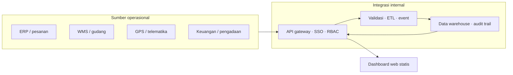

# Arsitektur Dashboard Pemantauan Ekspedisi dan Gudang

## Tujuan

Menyediakan satu tampilan kendali untuk:

1. Manajemen data operasional internal dan jejak audit.
2. Pemantauan order, perjalanan, kendaraan, dan kinerja pengiriman.
3. Kontrol penerimaan, pengeluaran, saldo, dan kebutuhan persediaan.
4. Pengendalian anggaran, biaya per pengiriman, tagihan, dan status pembayaran.

## Rancangan logis

Alur konseptual ini memisahkan data operasional dari antarmuka yang di-host di GitHub Pages. Untuk produksi, endpoint API harus berada di jaringan/layanan yang disetujui perusahaan dan memakai identitas perusahaan. Browser hanya menerima data yang sudah diizinkan untuk pengguna terkait.

## Domain dan indikator

| Domain | Data pokok | Indikator / kontrol |
| --- | --- | --- |
| Pengiriman | Order, detail muatan, penerima, milestone, proof of delivery | Order aktif, on-time delivery, lead time, gagal/tertahan |
| Armada | Kendaraan, pengemudi, jadwal, GPS, odometer, inspeksi | Siap operasi, utilisasi, jarak, keterlambatan, servis jatuh tempo |
| Gudang | Penerimaan, picking, pengeluaran, transfer, retur, stok opname | Masuk/keluar, saldo, selisih rekonsiliasi, utilisasi kapasitas |
| Persediaan | SKU, satuan, lokasi/bin, lot/batch, minimum stok | Stok tersedia/tertahan, reorder point, aging, stok kritis |
| Biaya | Akun biaya, anggaran, trip/order, pemasok, invoice, pembayaran | Realisasi vs anggaran, biaya per order/km, tagihan terbuka/jatuh tempo |
| Referensi | Gudang, produk, mitra, armada, akun biaya, pengguna/peran | Kelengkapan, status aktif, pemilik data, kualitas referensi |

## Model data konseptual

- **Shipment** (`shipment_id`, `order_id`, `customer_id`, `origin_warehouse_id`, `destination`, `planned_at`, `delivered_at`, `status`).
- **ShipmentLine** (`shipment_id`, `sku_id`, `quantity`, `unit`, `lot_id`).
- **Trip / GPSPoint** (`trip_id`, `shipment_id`, `vehicle_id`, `driver_id`, `event_time`, `latitude`, `longitude`, `event_type`). Lokasi GPS harus mengikuti retensi dan pembatasan akses yang berlaku.
- **WarehouseMovement** (`movement_id`, `movement_type`, `sku_id`, `warehouse_id`, `lot_id`, `quantity_delta`, `reference_id`, `occurred_at`, `recorded_by`). Setiap mutasi berkaitan dengan dokumen sumber.
- **InventoryBalance** (`sku_id`, `warehouse_id`, `lot_id`, `on_hand`, `reserved`, `available`, `as_of`). Saldo dapat direkonsiliasi ke mutasi dan stok opname.
- **CostTransaction** (`cost_id`, `shipment_id`, `trip_id`, `account_id`, `vendor_id`, `amount`, `budget_period`, `invoice_status`, `due_date`, `paid_at`).
- **Master entities**: Product/SKU, Warehouse, Vehicle, Driver, Customer, Vendor, CostAccount, User/Role.

Semua transaksi sebaiknya memiliki ID unik, cap waktu dengan zona waktu yang disepakati, sumber sistem, status validasi, dan pengguna/proses pencatat.

## Kontrol keamanan dan kualitas

- SSO, role-based access control, dan least privilege; pembatasan dapat berlaku per unit, gudang, atau fungsi.
- API mengautentikasi setiap permintaan; rahasia disimpan di server/secret manager dan tidak di bundle front-end.
- TLS saat pengiriman, enkripsi penyimpanan, audit atas baca/ubah/ekspor, serta pemantauan kegagalan.
- Validasi idempotensi dan referensi antar-domain; rekonsiliasi saldo dengan mutasi, serta biaya dengan invoice/anggaran.
- Backup dan pemulihan, retensi, klasifikasi data, dan mekanisme koreksi yang tidak menghapus histori audit.
- GitHub Pages hanya menerima aset UI dan data sintetis. Hindari menaruh data sensitif di repository, CSV statis, HTML, JavaScript, log publik, atau URL query.

## Tahap implementasi yang disarankan

1. Tetapkan pemilik proses dan sumber data resmi untuk pengiriman, gudang, GPS, dan keuangan.
2. Definisikan kamus data, ID lintas sistem, status/milestone, aturan stok, satuan, dan KPI beserta rumusnya.
3. Validasi kualitas dan ketersediaan data dengan sampel anonim; tetapkan klasifikasi serta hak akses.
4. Bangun API/integrasi privat dan lapisan histori; uji rekonsiliasi stok serta biaya terlebih dahulu.
5. Hubungkan UI lewat autentikasi yang disetujui, lakukan UAT per peran, audit keamanan, dan pemantauan.
6. Publikasikan UI statis pada GitHub Pages hanya jika pola akses API dan kebijakan perusahaan mengizinkannya. Jika akses privat membutuhkan jaringan internal, host dashboard di lingkungan perusahaan.

## Status prototipe saat ini

File `app.js` menggunakan data simulasi hard-coded untuk menunjukkan susunan halaman, navigasi, pencarian, dan unduhan CSV. Formulir dan tombol tidak menulis ke backend. Peta bersifat ilustratif dan tidak menampilkan posisi GPS. Angka, nama, ID, dan lokasi contoh harus diganti atau dihubungkan dengan API resmi sebelum pemakaian operasional.
